# Praval Deep Research - System Design

## Overview

Praval Deep Research is a local-first, agent-driven research assistant built on the Praval framework. This document explains the system architecture, data flow, and design decisions using diagrams and plain text (no code).

---

## Design Principles

### 1. Local-First Architecture
All data stays on your machine. Papers, embeddings, and metadata are stored in local Docker volumes. The only external dependencies are:
- ArXiv API (for paper metadata and PDFs)
- OpenAI API (for embeddings and LLM responses)

### 2. Agent-Driven Intelligence
The system uses 6 specialized Praval agents that communicate via message passing (spores). Each agent has:
- **Identity**: What it IS (not just what it does)
- **Memory**: Learns from past interactions
- **Autonomy**: Makes decisions independently
- **Intelligence**: LLM-powered reasoning

### 3. Production-Grade Infrastructure
Enterprise-ready components for reliability, scalability, and observability.

---

## System Architecture

### High-Level Component View

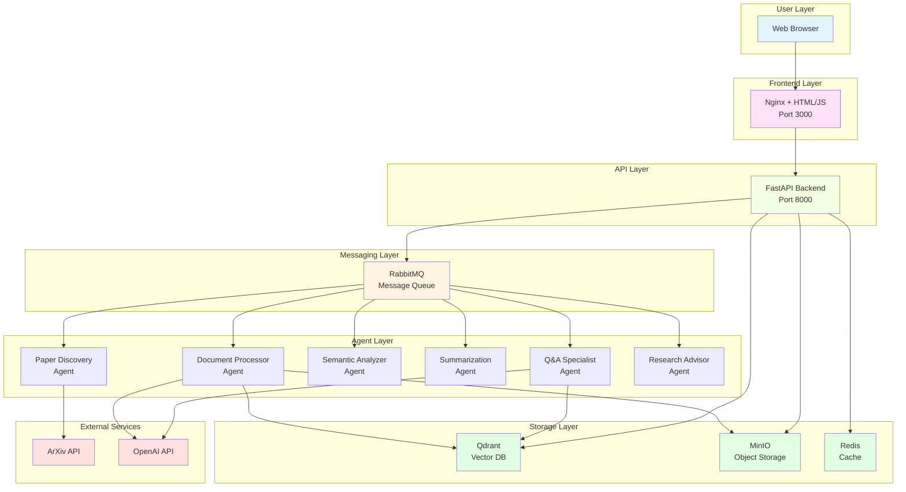

### Container Architecture

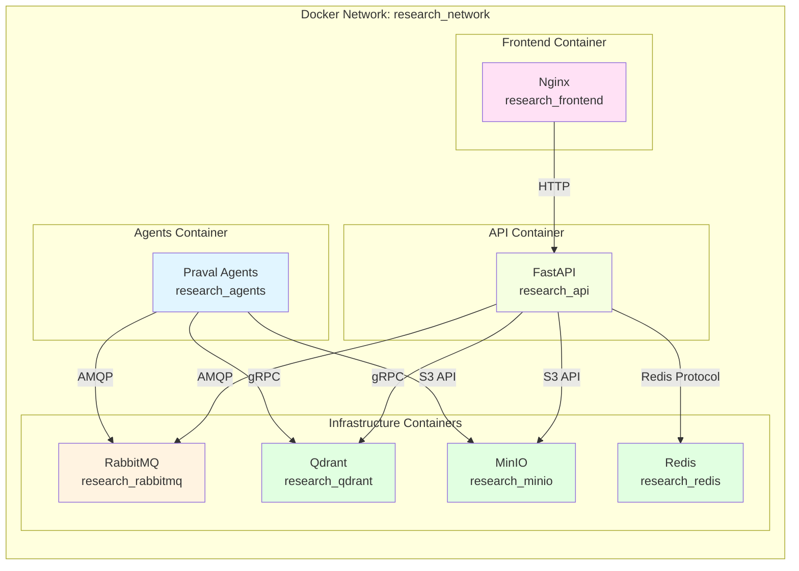

---

## Data Flow

### Paper Indexing Workflow

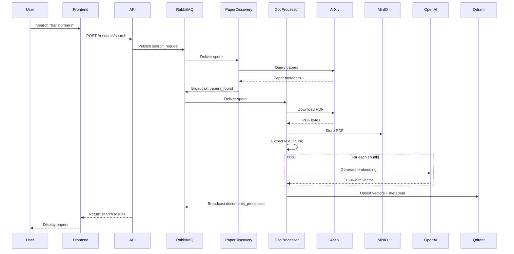

### Question Answering Workflow

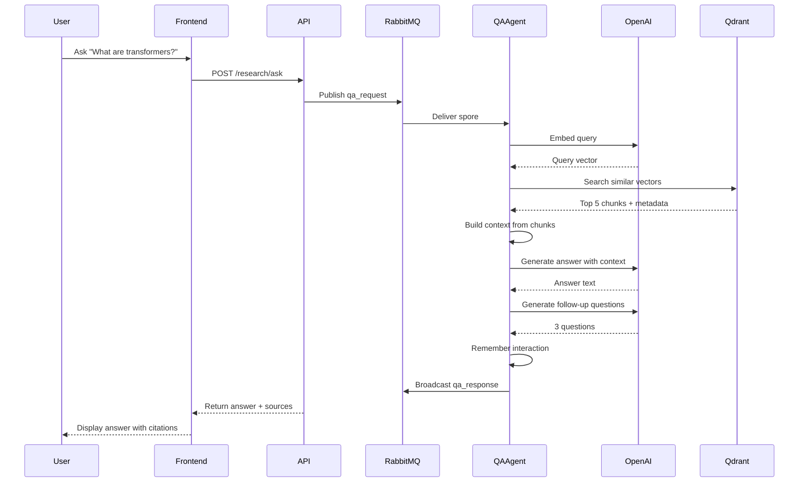

---

## Agent Architecture

### Praval Agent Structure

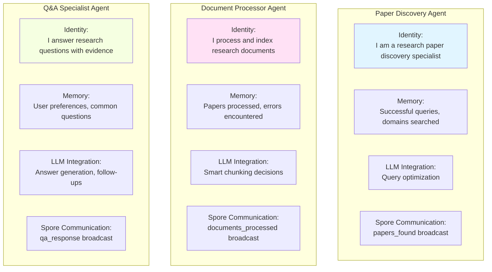

### Message Passing (Spores)

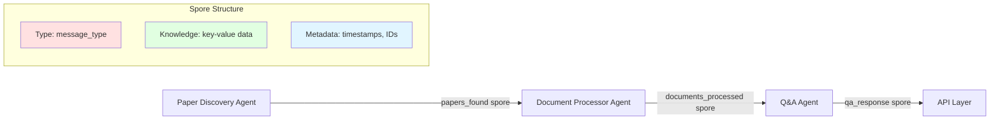

---

## Data Models

### Paper Metadata Flow

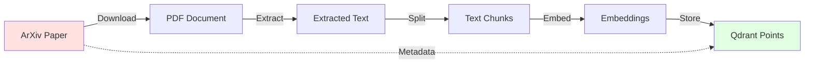

### Vector Point Structure in Qdrant

```
Point {
    id: hash(paper_id + chunk_index)
    vector: [1536-dimensional embedding]
    payload: {
        paper_id: "2312.05589v2"
        title: "Paper Title"
        authors: ["Author 1", "Author 2"]
        categories: ["cs.AI", "cs.LG"]
        published_date: "2023-12-09"
        chunk_text: "Full chunk content..."
        chunk_index: 5
        total_chunks: 50
        abstract: "Paper abstract..."
        pdf_path: "papers/2312.05589v2.pdf"
    }
}
```

---

## Storage Architecture

### Data Persistence Strategy

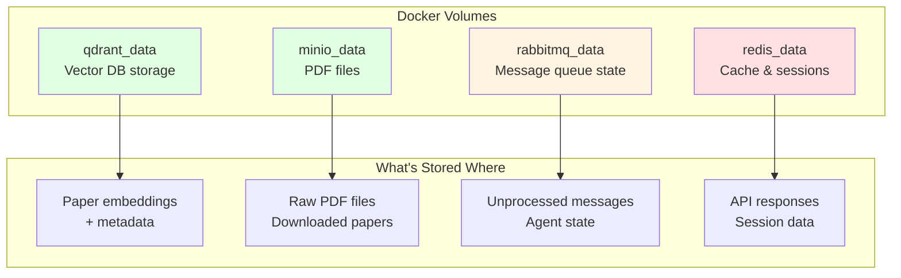

### Data Retention

- **Vectors in Qdrant**: Persistent until manually deleted
- **PDFs in MinIO**: Persistent, can grow large (plan ~100MB per paper)
- **Messages in RabbitMQ**: Transient, cleared after processing
- **Cache in Redis**: TTL-based expiration (default 1 hour)

---

## API Design

### REST Endpoints

```mermaid
graph TB
    subgraph "Research Endpoints"
        Search[POST /research/search<br/>Find ArXiv papers]
        Ask[POST /research/ask<br/>Answer questions]
        Index[POST /research/index<br/>Process selected papers]
    end

    subgraph "Knowledge Base Endpoints"
        List[GET /kb/papers<br/>List all indexed papers]
        Stats[GET /kb/stats<br/>Get statistics]
        Delete[DELETE /kb/papers/{id}<br/>Remove specific paper]
        Clear[DELETE /kb/clear<br/>Wipe all papers]
    end

    subgraph "System Endpoints"
        Health[GET /health<br/>Service health check]
        Sessions[GET /research/sessions<br/>Active research sessions]
    end

    style Search fill:#e1f5ff
    style Ask fill:#e1f5ff
    style List fill:#ffe1f5
    style Delete fill:#ffe1e1
```

### Real-Time Updates (SSE)

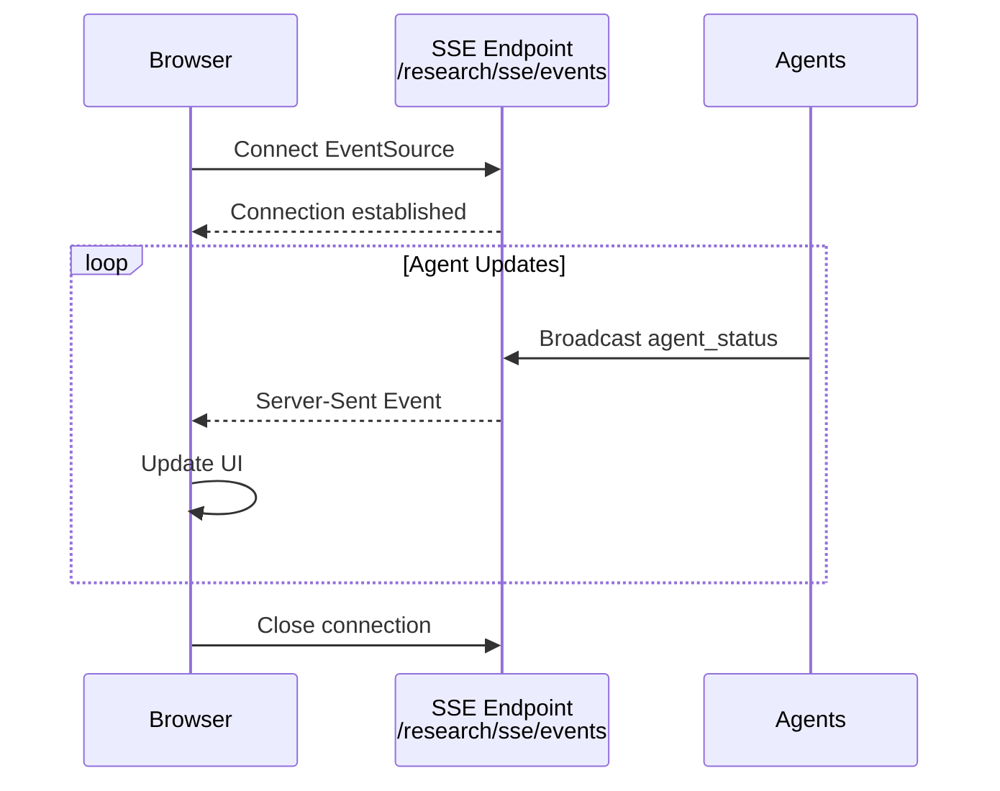

---

## Scaling Considerations

### Current Deployment (Single Machine)

```
Load: ~100 papers, ~5,000 vectors
Resources:
  - CPU: 4 cores recommended
  - RAM: 8GB minimum
  - Disk: 10GB for data
  - Network: Minimal (local only)
```

### Horizontal Scaling (Future)

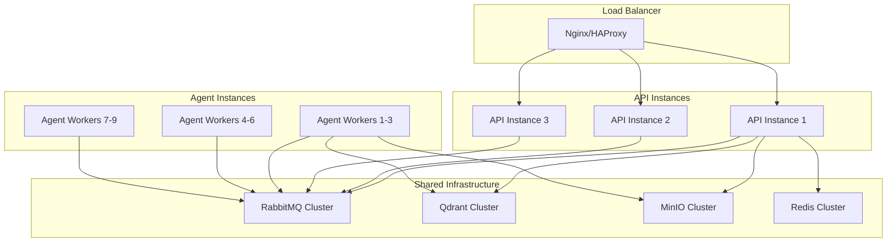

---

## Security Model

### Current Implementation

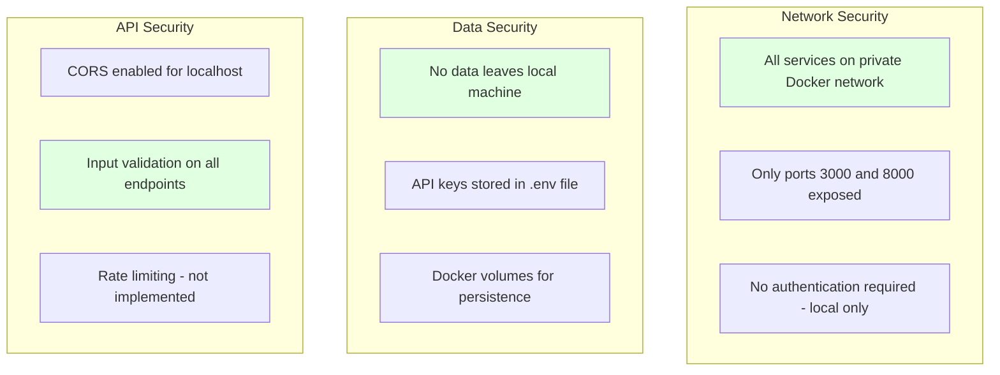

### Future Enhancements

- Add authentication (JWT tokens)
- Implement role-based access control (RBAC)
- Add rate limiting per user
- Enable HTTPS for API
- Add audit logging for deletions

---

## Performance Characteristics

### Benchmarks (Typical)

```
Paper Processing:
  - Download PDF: 2-5 seconds
  - Extract text: 5-10 seconds
  - Generate embeddings: 10-20 seconds (50 chunks)
  - Store vectors: 1-2 seconds
  - Total: 30-60 seconds per paper

Question Answering:
  - Embed query: 0.5 seconds
  - Vector search: 0.1 seconds
  - Generate answer: 2-5 seconds
  - Total: 3-6 seconds per question

Knowledge Base Operations:
  - List papers: 0.2 seconds (100 papers)
  - Delete paper: 0.5 seconds
  - Get stats: 0.3 seconds
```

### Bottlenecks

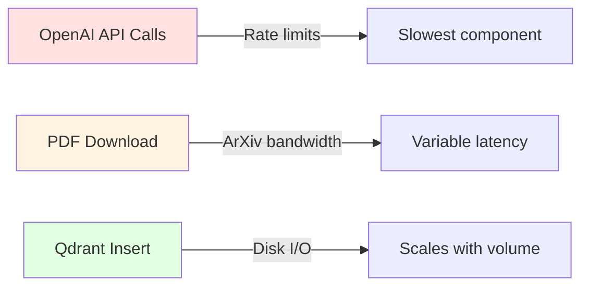

---

## Error Handling Strategy

### Agent-Level Error Handling

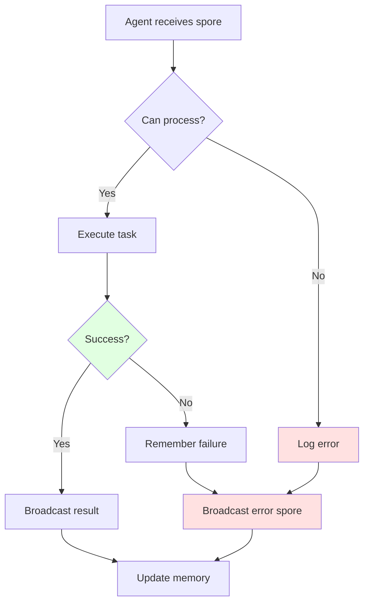

### Retry Strategy

- **Network errors**: 3 retries with exponential backoff
- **OpenAI rate limits**: Respect retry-after headers
- **Qdrant errors**: Single retry, then fail gracefully
- **ArXiv errors**: Single retry with 5 second delay

---

## Monitoring & Observability

### Metrics Collection

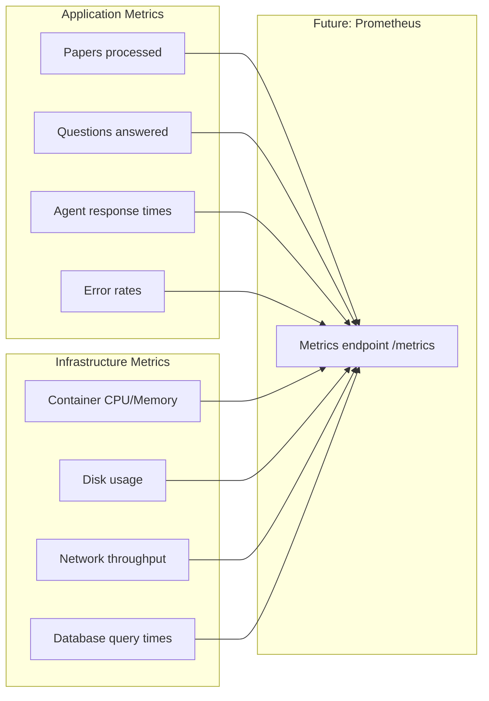

### Logging Strategy

```
Structure: JSON logs with structured fields
Levels:
  - DEBUG: Agent internal state
  - INFO: Normal operations
  - WARNING: Degraded performance
  - ERROR: Operation failures

Log rotation: Daily, keep 7 days
```

---

## Deployment Architecture

### Development vs Production

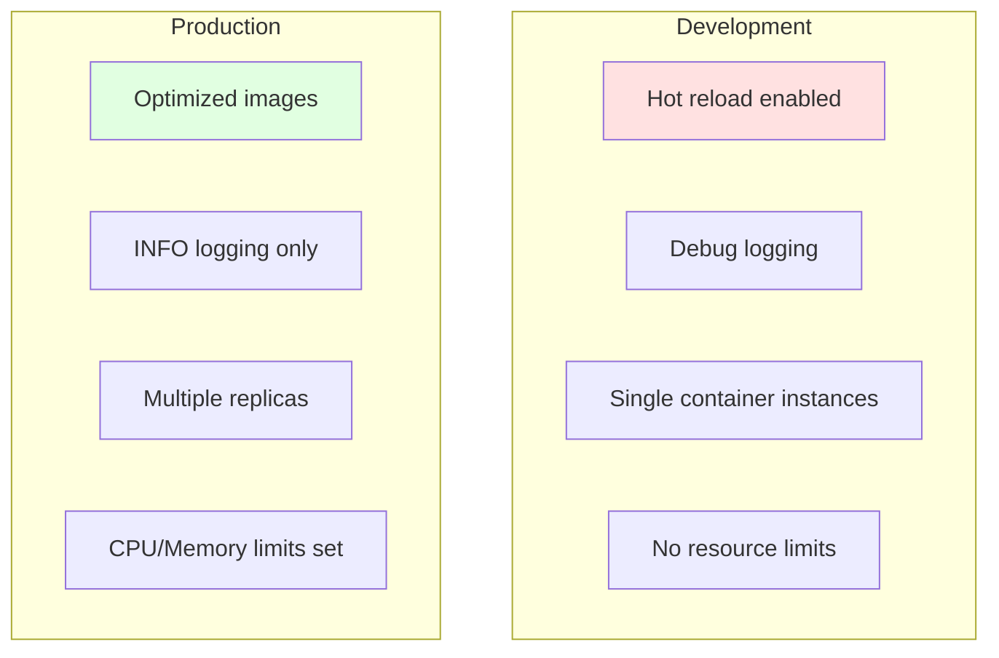

---

## Future Architecture Enhancements

### Planned Improvements

1. **Multi-Source Support**
   - Add PubMed, IEEE, Google Scholar connectors
   - Unified paper metadata schema
   - Source-specific processing agents

2. **Intelligent Curation**
   - Knowledge Base Manager Agent
   - Automatic redundancy detection
   - Usage-based paper recommendations

3. **Advanced Features**
   - Citation graph analysis
   - Paper recommendation engine
   - Research workflow automation
   - Collaborative research sessions

4. **Infrastructure**
   - Kubernetes deployment option
   - Multi-tenant support
   - Distributed vector search
   - Advanced caching strategies

---

This design document focuses on **understanding** the system through diagrams and plain text. For implementation details, see the codebase and CLAUDE.md.
