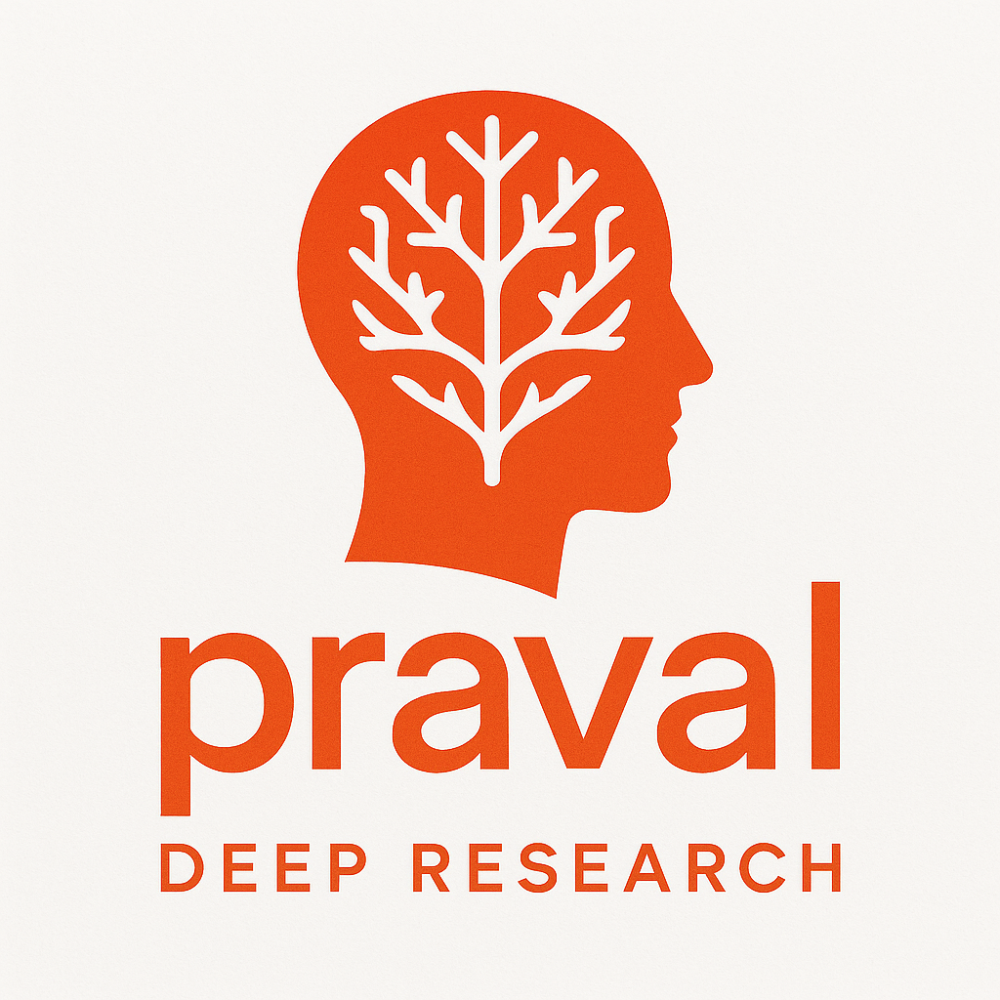

<div align="center">



# Praval Deep Research

**A Local-First, AI-Powered Research Assistant for ArXiv Papers**

<p align="center">
  <a href="https://pravalagents.com">
    
  </a>
</p>

Built with the [Praval Agentic Framework](https://pravalagents.com) - demonstrating production-grade, identity-driven agent architecture for intelligent research workflows.

</div>

---

## 🎯 What Is This?

Praval Deep Research is a **completely local**, privacy-focused research assistant that helps you discover, analyze, and understand academic papers from ArXiv. Unlike cloud-based solutions, all your research data stays on your machine, with intelligent multi-agent processing powered by the Praval framework.

### Core Philosophy

**Local-First Architecture**
- All data processing happens on your infrastructure
- Papers and embeddings stored in local vector database
- Complete control over your research knowledge base
- No external dependencies except ArXiv API and LLM providers

**Agent-Driven Intelligence**
- Built on [Praval](https://pravalagents.com) - the modern agentic framework
- 6 specialized agents with memory and learning capabilities
- Identity-driven design: agents ARE specialists, not just function executors
- Self-organizing workflow through message passing (spores)

**ArXiv-Focused**
- Current build optimized for ArXiv paper research
- Semantic search across downloaded papers
- Intelligent Q&A using vector embeddings
- Knowledge base management for your research corpus

---

## ✨ Key Features

### 📚 Paper Discovery & Management
- **Smart Search**: Query ArXiv with domain-specific filtering
- **Automatic Processing**: Downloads PDFs, extracts text, generates embeddings
- **Knowledge Base**: View all indexed papers with statistics
- **Easy Management**: Delete papers or clear knowledge base with one click

### 💬 Intelligent Q&A
- **Semantic Search**: Vector-based retrieval finds relevant paper sections
- **Context-Aware Answers**: LLM generates answers using retrieved evidence
- **Source Citations**: Every answer cites specific papers and relevance scores
- **Follow-up Suggestions**: Get 3 related questions to explore deeper

### 🤖 Praval Agent Architecture
Six specialized agents working autonomously:

1. **Paper Discovery Agent** - Searches and ranks ArXiv papers
2. **Document Processor Agent** - Downloads, extracts, chunks, embeds
3. **Semantic Analyzer Agent** - Identifies themes across papers
4. **Summarization Agent** - Creates comprehensive syntheses
5. **Q&A Specialist Agent** - Answers questions using retrieved context
6. **Research Advisor Agent** - Provides strategic research guidance

Each agent has:
- **Memory**: Learns from interactions and improves over time
- **Identity**: Clear specialization and domain expertise
- **Intelligence**: LLM-powered decision making
- **Autonomy**: Self-organizing through message passing

### 🏗️ Production-Grade Infrastructure
- **Vector Database**: Qdrant for semantic search (1536-dim OpenAI embeddings)
- **Object Storage**: MinIO for PDF storage
- **Message Queue**: RabbitMQ for reliable agent communication
- **Cache Layer**: Redis for session management
- **Real-time Updates**: Server-Sent Events for live progress tracking
- **Monitoring**: Prometheus metrics and structured logging

---

## 🚀 Quick Start

### Prerequisites

- **Docker & Docker Compose** (required)
- **OpenAI API Key** (for embeddings and LLM)
- **8GB+ RAM** (recommended)
- **10GB+ Disk Space** (for papers and vectors)

### 1. Clone and Configure

```bash
git clone https://github.com/yourusername/agentic_deep_research.git
cd agentic_deep_research

# Copy environment template
cp .env.example .env

# Edit and add your OpenAI API key
nano .env
# Set: OPENAI_API_KEY=sk-your-key-here
```

### 2. Deploy (One Command)

```bash
# Deploy backend + frontend
./scripts/deploy.sh --with-frontend

# Or deploy everything including monitoring
./scripts/deploy.sh --with-monitoring
```

### 3. Access Your Research Assistant

- **Frontend**: http://localhost:3000
- **API Documentation**: http://localhost:8000/docs
- **Knowledge Base**: http://localhost:3000/knowledge-base.html

---

## 📖 How It Works

### Research Workflow


### Example Usage

**1. Search for Papers**
```
Query: "transformer attention mechanisms"
Domain: AI
Results: 10 relevant ArXiv papers
```

**2. Papers Are Automatically Processed**
- PDFs downloaded to local MinIO storage
- Text extracted and chunked intelligently
- Embeddings generated with OpenAI text-embedding-3-small
- Vectors stored in local Qdrant database
- ~30-60 seconds per paper

**3. Ask Questions**
```
Q: "What are the key innovations in transformer architecture?"
A: [Generated answer with citations from your indexed papers]
Sources:
- "Attention Is All You Need" (relevance: 0.89)
- "BERT: Pre-training..." (relevance: 0.84)
- "Transformer-XL..." (relevance: 0.78)
```

**4. Manage Your Knowledge Base**
- View all 28 indexed papers
- See 1,641 stored vectors
- Average 58.6 chunks per paper
- Delete papers or clear entire knowledge base

---

## 🏛️ Architecture

### System Overview

```
┌─────────────────────────────────────────────────────┐
│                    Frontend (Port 3000)              │
│        HTML/CSS/JS with Tailwind + Real-time SSE    │
└───────────────────┬─────────────────────────────────┘
                    │
┌───────────────────▼─────────────────────────────────┐
│              FastAPI Backend (Port 8000)             │
│           REST API + WebSocket + Health Checks      │
└───────────────────┬─────────────────────────────────┘
                    │
        ┌───────────┼───────────┐
        │           │           │
┌───────▼──┐  ┌────▼────┐  ┌──▼──────┐
│ RabbitMQ │  │  Redis  │  │  Praval │
│ Messages │  │  Cache  │  │  Agents │
└──────────┘  └─────────┘  └────┬────┘
                                 │
                    ┌────────────┼────────────┐
                    │            │            │
              ┌─────▼───┐  ┌────▼────┐  ┌───▼────┐
              │ Qdrant  │  │  MinIO  │  │ OpenAI │
              │ Vectors │  │  PDFs   │  │  API   │
              └─────────┘  └─────────┘  └────────┘
```

### Data Flow

**Paper Indexing**:
1. User searches ArXiv → Paper Discovery Agent finds papers
2. Papers sent to Document Processor Agent
3. PDFs downloaded and stored in MinIO
4. Text extracted and chunked (1000 chars, 200 overlap)
5. Embeddings generated via OpenAI API
6. Vectors stored in Qdrant with full metadata
7. Papers ready for semantic search

**Question Answering**:
1. User asks question → Q&A Specialist Agent receives query
2. Query embedded via OpenAI API
3. Qdrant searches for top-5 most relevant chunks
4. Retrieved context + query sent to LLM
5. Answer generated with source citations
6. Follow-up questions suggested

---

## 🔧 Configuration

### Environment Variables

```bash
# Required
OPENAI_API_KEY=sk-your-key-here

# Optional (sensible defaults provided)
CHUNK_SIZE=1000                    # Text chunk size
CHUNK_OVERLAP=200                  # Overlap between chunks
MAX_CHUNKS_PER_PAPER=50           # Limit chunks per paper
EMBEDDING_DIMENSIONS=1536          # OpenAI embedding size
QDRANT_COLLECTION_NAME=research_vectors
```

### Storage Locations

All data stored locally in Docker volumes:

- **Papers (PDFs)**: `minio_data` volume
- **Vectors**: `qdrant_data` volume
- **Messages**: `rabbitmq_data` volume
- **Cache**: `redis_data` volume

To completely reset:
```bash
./scripts/clean.sh  # Removes all data and containers
```

---

## 📊 Monitoring & Management

### View Services Status

```bash
docker-compose ps
```

### View Logs

```bash
# API logs
docker-compose logs -f research_api

# Agent logs
docker-compose logs -f research_agents

# All services
docker-compose logs -f
```

### Access Management Interfaces

- **RabbitMQ Management**: http://localhost:15672
  - User: `research_user`, Pass: `research_pass`
- **MinIO Console**: http://localhost:9001
  - User: `minioadmin`, Pass: `minioadmin`
- **Prometheus** (if enabled): http://localhost:9090

### Knowledge Base Statistics

```bash
# Get stats via API
curl http://localhost:8000/research/knowledge-base/stats | jq

# List all papers
curl http://localhost:8000/research/knowledge-base/papers | jq
```

---

## 🧪 Development

### Local Development (Without Docker)

```bash
# Install dependencies
python -m venv .venv
source .venv/bin/activate
pip install -r requirements.txt

# Start infrastructure only
docker-compose up -d rabbitmq qdrant minio redis

# Run API
cd src
python -m uvicorn agentic_research.api.main:app --reload --port 8000

# Run agents (separate terminal)
python run_agents.py

# Serve frontend (separate terminal)
cd frontend
python -m http.server 3000
```

### Testing

```bash
# Test paper search
curl -X POST http://localhost:8000/research/search \
  -H "Content-Type: application/json" \
  -d '{"query": "neural networks", "domain": "computer_science", "max_results": 3}'

# Test Q&A
curl -X POST http://localhost:8000/research/ask \
  -H "Content-Type: application/json" \
  -d '{"question": "What are transformers?"}'
```

---

## 🌟 Built with Praval

This project showcases the power of the [Praval Agentic Framework](https://pravalagents.com):

### Why Praval?

**Identity-Driven Agents**
- Agents are defined by what they ARE, not just what they DO
- Clear specialization leads to better performance
- Natural language identity statements guide behavior

**Memory & Learning**
- Agents remember past interactions
- Continuous improvement through recall
- Context-aware decision making

**Self-Organizing**
- No central coordinator needed
- Agents communicate via message passing (spores)
- Emergent intelligence from simple interactions

**Production-Ready**
- Type-safe, well-tested framework
- Enterprise-grade reliability
- Scales horizontally

### Learn More About Praval

- **Website**: [pravalagents.com](https://pravalagents.com)
- **Documentation**: Comprehensive guides and examples
- **Philosophy**: Identity-driven, memory-enabled, LLM-integrated agents

---

## 🗺️ Roadmap

### Current (v1.0)
- ✅ ArXiv paper search and indexing
- ✅ Semantic Q&A over indexed papers
- ✅ Knowledge base management
- ✅ Real-time agent updates via SSE
- ✅ 6 specialized Praval agents

### Planned
- 🔄 Support for more paper sources (PubMed, IEEE, etc.)
- 🔄 Intelligent knowledge base curation agent
- 🔄 Paper recommendation system
- 🔄 Research workflow automation
- 🔄 Citation graph analysis
- 🔄 Multi-user support with authentication

---

## 🐛 Troubleshooting

### API Won't Start

```bash
# Check infrastructure health
docker-compose ps

# Verify OpenAI API key is set
grep OPENAI_API_KEY .env

# View API logs
docker-compose logs research_api
```

### Q&A Returns No Results

```bash
# Check if papers are indexed
curl http://localhost:8000/research/knowledge-base/stats

# Verify Qdrant has vectors
curl http://localhost:6333/collections/research_vectors
```

### Frontend Can't Connect

```bash
# Check API is accessible
curl http://localhost:8000/health

# Verify nginx config
docker-compose exec research_frontend cat /etc/nginx/conf.d/default.conf
```

---

## 📄 License

MIT License - see LICENSE file for details.

---

## 🙏 Acknowledgments

- **[Praval Framework](https://pravalagents.com)** - The foundation of this agentic system
- **[ArXiv](https://arxiv.org)** - Open access to research papers
- **[Qdrant](https://qdrant.tech)** - High-performance vector database
- **[FastAPI](https://fastapi.tiangolo.com)** - Modern Python web framework
- **[OpenAI](https://openai.com)** - Embeddings and language models

---

## 📞 Support

- **Documentation**: See `/docs` folder for detailed guides
- **Issues**: GitHub issues for bug reports and feature requests
- **Praval Framework**: [pravalagents.com](https://pravalagents.com) for framework documentation

---

**Built with ❤️ using Praval - Demonstrating production-grade agentic architecture for research automation.**
