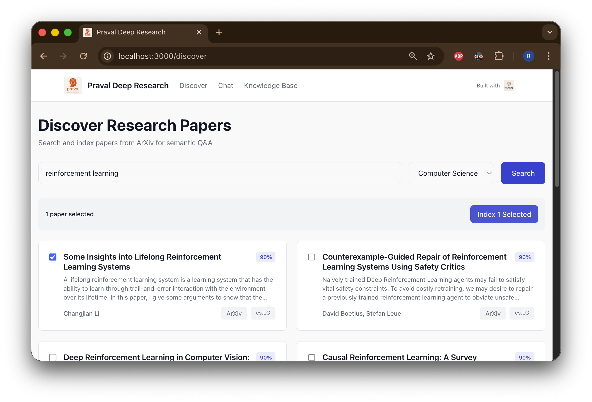
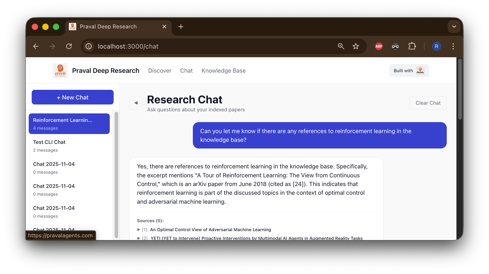
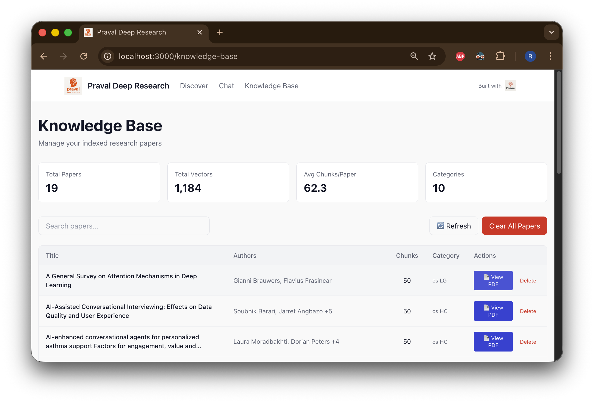
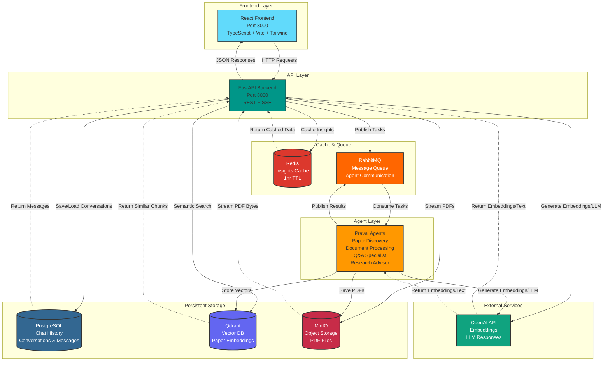

<div align="center">


# Praval Deep Research

**A Local-First, AI-Powered Research Assistant for ArXiv Papers**

<p align="center">
  <a href="https://pravalagents.com">
    
  </a>
</p>

Built with the [Praval Agentic Framework](https://pravalagents.com) - demonstrating production-grade, identity-driven agent architecture for intelligent research workflows.

[](https://react.dev)
[](https://www.typescriptlang.org/)
[](https://fastapi.tiangolo.com)
[](https://pravalagents.com)
[](https://www.docker.com/)

</div>

---

## 🎯 What Is This?

Praval Deep Research is a **completely local**, privacy-focused research assistant that helps you discover, analyze, and understand academic papers from ArXiv. Unlike cloud-based solutions, all your research data stays on your machine, with intelligent multi-agent processing powered by the Praval framework.

<div align="center">

<p><em>Modern React interface with Discover, Chat, and Knowledge Base features</em></p>
</div>

### Core Philosophy

**Local-First Architecture**
- All data processing happens on your infrastructure
- Papers and embeddings stored in local vector database
- Complete control over your research knowledge base
- No external dependencies except ArXiv API and LLM providers

**Agent-Driven Intelligence**
- Built on [Praval](https://pravalagents.com) - the modern agentic framework
- 6 specialized agents with memory and learning capabilities
- Identity-driven design: agents ARE specialists, not just function executors
- Self-organizing workflow through message passing (spores)

**ArXiv-Focused**
- Current build optimized for ArXiv paper research
- Semantic search across downloaded papers
- Intelligent Q&A using vector embeddings
- Knowledge base management for your research corpus

---

## ✨ Key Features

### 📚 Paper Discovery & Management
- **Smart Search**: Query ArXiv with domain-specific filtering
- **Automatic Processing**: Downloads PDFs, extracts text, generates embeddings
- **Knowledge Base**: View all indexed papers with statistics and metadata
- **PDF Viewing**: Open and read papers directly in your browser
- **Easy Management**: Delete individual papers or clear entire knowledge base

### 💬 Intelligent Conversations

<div align="center">

<p><em>Persistent chat history with auto-generated conversation titles</em></p>
</div>

- **Chat History**: All conversations automatically saved with PostgreSQL (persistent relational storage)
- **Smart Titles**: LLM-generated conversation names (like ChatGPT/Claude)
- **Conversation Management**: Create, load, and delete chat threads with cascade integrity
- **Context-Aware Answers**: LLM generates answers using retrieved evidence
- **Source Citations**: Every answer cites specific papers with relevance scores
- **Follow-up Suggestions**: Get 3 related questions to explore deeper
- **Copy with Citations**: Easy sharing of assistant responses with full source attribution

### 📖 Knowledge Base Management

<div align="center">

<p><em>Comprehensive knowledge base with inline PDF viewing</em></p>
</div>

- **Paper Catalog**: Sortable table of all indexed papers
- **Statistics Dashboard**: Real-time metrics on papers, vectors, and categories
- **PDF Access**: View any indexed paper with one click
- **Search & Filter**: Find specific papers in your collection
- **Bulk Operations**: Clear entire knowledge base when needed

### 🤖 Praval Agent Architecture
Six specialized agents working autonomously:

1. **Paper Discovery Agent** - Searches and ranks ArXiv papers with memory-driven optimization
2. **Document Processor Agent** - Downloads, extracts, chunks, and generates embeddings
3. **Semantic Analyzer Agent** - Identifies themes and connections across papers
4. **Summarization Agent** - Creates comprehensive paper syntheses
5. **Q&A Specialist Agent** - Answers questions using retrieved context and personalization
6. **Research Advisor Agent** - Provides strategic research guidance

Each agent has:
- **Memory**: Learns from interactions and improves over time
- **Identity**: Clear specialization and domain expertise
- **Intelligence**: LLM-powered decision making
- **Autonomy**: Self-organizing through message passing

### 🎨 Modern User Experience
- **React + TypeScript**: Type-safe, component-based frontend
- **Tailwind CSS**: Clean, accessible design with proper color contrast
- **Responsive Design**: Works on desktop and tablet
- **Real-time Updates**: Live progress tracking during indexing
- **Keyboard Shortcuts**: Efficient navigation and interaction
- **Dark Mode Ready**: Infrastructure for theme switching

### 🔮 Proactive Research Insights (NEW)
- **Interactive Topic Discovery**: Click trending topics to instantly search and view papers
- **Research Area Clustering**: AI-powered identification of your research themes
- **Trending Topics**: Automatically extracted from your indexed papers
- **Research Gaps**: AI suggests unexplored areas and opportunities
- **Personalized Next Steps**: Strategic research recommendations based on chat history
- **Smart Caching**: Insights generated in 35s, cached for instant retrieval (1hr TTL)
- **Context-Aware**: Analyzes both knowledge base and recent conversation patterns

### 🏗️ Production-Grade Infrastructure
- **Vector Database**: Qdrant for semantic search (1536-dim OpenAI embeddings)
- **Persistent Storage**: PostgreSQL for chat conversation history with relational integrity
- **Performance Cache**: Redis for research insights caching (1-hour TTL, 35s→instant)
- **Object Storage**: MinIO for PDF storage with streaming proxy
- **Message Queue**: RabbitMQ for reliable agent communication
- **Real-time Updates**: Server-Sent Events for live progress tracking
- **Containerized**: Full Docker Compose deployment with health checks
- **Monitoring**: Structured logging with JSON output

---

## 🚀 Quick Start

### Prerequisites

- **Docker & Docker Compose** (required)
- **OpenAI API Key** (for embeddings and LLM)
- **8GB+ RAM** (recommended)
- **10GB+ Disk Space** (for papers and vectors)

### 1. Clone and Configure

```bash
git clone https://github.com/aiexplorations/praval_deep_research.git
cd praval_deep_research

# Copy environment template
cp .env.example .env

# Edit and add your OpenAI API key
nano .env
# Set: OPENAI_API_KEY=sk-your-key-here
```

### 2. Deploy (One Command)

```bash
# Build and start all services
docker-compose up -d

# Check status
docker-compose ps

# View logs
docker-compose logs -f research_frontend research_api
```

### 3. Access Your Research Assistant

- **Frontend**: http://localhost:3000
- **API Documentation**: http://localhost:8000/docs
- **RabbitMQ Management**: http://localhost:15672 (user: `research_user`, pass: `research_pass`)
- **MinIO Console**: http://localhost:9001 (user: `minioadmin`, pass: `minioadmin`)

---

## 📖 How It Works

### Research Workflow


### Example Usage

**1. Discover Papers**
- Navigate to the **Discover** page
- Search: "transformer attention mechanisms"
- Select papers and click "Index Selected"
- Watch real-time processing updates

**2. Papers Are Automatically Processed**
- PDFs downloaded to local MinIO storage
- Text extracted and chunked intelligently (1000 chars, 200 overlap)
- Embeddings generated with OpenAI text-embedding-3-small
- Vectors stored in local Qdrant database
- ~30-60 seconds per paper

**3. Ask Questions in Chat**
- Navigate to the **Chat** page
- Ask: "What are the key innovations in transformer architecture?"
- Receive answer with source citations
- Conversation auto-saves with smart title (generated by LLM)
- Access chat history from sidebar
- Copy answers with citations for easy sharing

**4. Explore Proactive Research Insights**
- View AI-generated research insights at bottom of Discover page
- See your research areas, trending topics, and identified gaps
- Click any trending topic to instantly search and view papers
- Get personalized next steps based on your research patterns

**5. Manage Your Knowledge Base**
- Navigate to **Knowledge Base** page
- View all 28 indexed papers
- See 1,641 stored vectors
- Average 58.6 chunks per paper
- Click "View PDF" to read any paper
- Delete papers or clear entire knowledge base

---

## 🏛️ Architecture

### System Overview



**Data Flow:**
1. **User Request** → Frontend makes HTTP request to Backend API
2. **Backend Processing** → API coordinates with storage (PostgreSQL, Redis, Qdrant, MinIO)
3. **Agent Tasks** → Backend publishes heavy processing tasks to RabbitMQ
4. **Agent Execution** → Praval agents consume tasks, process data, access storage and OpenAI
5. **Response Delivery** → Results flow back through RabbitMQ or direct API response to Frontend

**Storage Strategy:**
- **PostgreSQL**: Durable relational data (conversations, messages) with ACID guarantees
- **Redis**: High-performance cache (research insights) with TTL expiration
- **Qdrant**: Semantic search vectors for intelligent paper retrieval
- **MinIO**: Large binary objects (PDF files) with S3-compatible API

### New Features in Latest Version

**Storage Architecture Enhancements**
- **PostgreSQL**: Persistent relational storage for chat conversations and messages
- **Redis**: High-performance caching for research insights (1hr TTL)
- Hybrid strategy: Durable data in PostgreSQL, performance cache in Redis
- CASCADE delete integrity for conversations and messages
- SQLAlchemy async ORM with connection pooling

**Proactive Research Insights**
- AI-powered research area identification from indexed papers
- Trending topic extraction with clickable search
- Research gap discovery and opportunity suggestions
- Personalized next steps based on chat history
- Interactive insights: click topics to instantly search papers
- Smart caching: 35s generation → instant retrieval

**Chat History & Conversations**
- Persistent conversation storage in PostgreSQL with relational integrity
- Auto-generated titles using GPT-4o-mini
- Conversation list with message counts and timestamps
- Delete conversations with CASCADE to remove all messages
- Auto-load most recent conversation
- Copy answers with citations for easy sharing

**Frontend Enhancements**
- Multi-stage Docker build (Node.js → Nginx)
- Production-optimized React bundle with code splitting
- Improved chat layout with full-height display
- One-click topic search from insights panel
- PDF streaming through API proxy
- Opens in new tab for reading
- Inline display in browser

**UX Improvements**
- Improved color palette with WCAG AA contrast
- Removed annoying confirmation dialogs
- Hover-activated delete buttons
- Modern rounded UI elements
- Praval branding in header

---

## 🔧 Configuration

### Environment Variables

```bash
# Required
OPENAI_API_KEY=sk-your-key-here

# Optional (sensible defaults provided)
CHUNK_SIZE=1000                    # Text chunk size
CHUNK_OVERLAP=200                  # Overlap between chunks
MAX_CHUNKS_PER_PAPER=50           # Limit chunks per paper
EMBEDDING_DIMENSIONS=1536          # OpenAI embedding size
QDRANT_COLLECTION_NAME=research_vectors

# MinIO Configuration
MINIO_ENDPOINT=minio:9000              # Internal endpoint
MINIO_EXTERNAL_ENDPOINT=localhost:9000 # Browser-accessible endpoint
```

### Storage Locations

All data stored locally in Docker volumes:

- **Papers (PDFs)**: `minio_data` volume (~1-5GB per 100 papers)
- **Vectors**: `qdrant_data` volume (~200MB per 1000 chunks)
- **Messages**: `rabbitmq_data` volume
- **Conversations**: `redis_data` volume
- **Frontend**: Served from Nginx container

To backup data:
```bash
# Backup volumes
docker run --rm -v praval_deep_research_qdrant_data:/data -v $(pwd):/backup \
  alpine tar czf /backup/qdrant_backup.tar.gz /data

# Restore
docker run --rm -v praval_deep_research_qdrant_data:/data -v $(pwd):/backup \
  alpine tar xzf /backup/qdrant_backup.tar.gz -C /
```

---

## 📊 Monitoring & Management

### View Services Status

```bash
docker-compose ps

# Expected output:
# research_api        Up (healthy)
# research_frontend   Up (healthy)
# research_qdrant     Up
# research_minio      Up (healthy)
# research_rabbitmq   Up (healthy)
# research_redis      Up (healthy)
```

### View Logs

```bash
# Frontend logs
docker-compose logs -f research_frontend

# API logs
docker-compose logs -f research_api

# All services
docker-compose logs -f
```

### Knowledge Base API

```bash
# Get stats
curl http://localhost:8000/research/knowledge-base/stats | jq

# List all papers
curl http://localhost:8000/research/knowledge-base/papers | jq

# Get specific paper PDF
curl http://localhost:8000/research/knowledge-base/papers/2504.13908v2/pdf > paper.pdf
```

### Conversation Management

```bash
# List all conversations
curl http://localhost:8000/research/conversations | jq

# Get specific conversation with messages
curl http://localhost:8000/research/conversations/{conversation_id} | jq
```

---

## 🧪 Development

### Local Development (With Docker for services)

```bash
# Start infrastructure only
docker-compose up -d rabbitmq qdrant minio redis

# Frontend development (with hot reload)
cd frontend-new
npm install
npm run dev
# Opens on http://localhost:3001

# Backend development (separate terminal)
cd src
python -m venv .venv
source .venv/bin/activate
pip install -r requirements.txt
python -m uvicorn agentic_research.api.main:app --reload --port 8000
```

### Building for Production

```bash
# Build all containers
docker-compose build

# Build specific service
docker-compose build research_frontend

# Check image sizes
docker images | grep praval_deep_research
```

### Testing

```bash
# Test paper search
curl -X POST http://localhost:8000/research/search \
  -H "Content-Type: application/json" \
  -d '{"query": "neural networks", "max_results": 3}'

# Test Q&A
curl -X POST http://localhost:8000/research/ask \
  -H "Content-Type: application/json" \
  -d '{"question": "What are transformers?", "include_sources": true}'

# Test conversation creation
curl -X POST http://localhost:8000/research/conversations \
  -H "Content-Type: application/json" \
  -d '{"title": "My Research Chat"}'
```

---

## 🌟 Built with Praval

This project showcases the power of the [Praval Agentic Framework](https://pravalagents.com):

### Why Praval?

**Identity-Driven Agents**
- Agents are defined by what they ARE, not just what they DO
- Clear specialization leads to better performance
- Natural language identity statements guide behavior

**Memory & Learning**
- Agents remember past interactions using `remember()` and `recall()`
- Continuous improvement through experience
- Context-aware decision making with historical patterns

**Self-Organizing**
- No central coordinator needed
- Agents communicate via message passing (spores)
- Emergent intelligence from simple interactions

**Production-Ready**
- Type-safe, well-tested framework
- Enterprise-grade reliability
- Scales horizontally with Docker

### Learn More About Praval

- **Website**: [pravalagents.com](https://pravalagents.com)
- **Documentation**: Comprehensive guides and examples
- **Philosophy**: Identity-driven, memory-enabled, LLM-integrated agents

---

## 🗺️ Roadmap

### Current (v1.0)
- ✅ ArXiv paper search and indexing
- ✅ Semantic Q&A over indexed papers
- ✅ Knowledge base management with PDF viewing
- ✅ Chat history with persistent conversations
- ✅ Auto-generated conversation titles
- ✅ Modern React + TypeScript frontend
- ✅ Full Docker containerization
- ✅ 6 specialized Praval agents with memory

### In Progress
- 🔄 Voice interface for hands-free research
- 🔄 Advanced filtering and search in knowledge base
- 🔄 Export conversations and research notes

### Planned
- 📋 Support for more paper sources (PubMed, IEEE, etc.)
- 📋 Intelligent knowledge base curation agent
- 📋 Paper recommendation system
- 📋 Research workflow automation
- 📋 Citation graph analysis
- 📋 Multi-user support with authentication
- 📋 Custom embedding models
- 📋 Offline LLM support (Ollama integration)

---

## 🐛 Troubleshooting

### Services Won't Start

```bash
# Check Docker is running
docker ps

# Check for port conflicts
lsof -i :3000  # Frontend
lsof -i :8000  # API
lsof -i :9000  # MinIO

# Restart all services
docker-compose down
docker-compose up -d

# Check logs for errors
docker-compose logs research_api
```

### Frontend Shows Blank Page

```bash
# Hard refresh browser
# Chrome/Edge: Ctrl+Shift+R (Windows) or Cmd+Shift+R (Mac)
# Firefox: Ctrl+F5 or Cmd+Shift+R

# Check if frontend container is running
docker-compose ps research_frontend

# Check nginx logs
docker-compose logs research_frontend
```

### Q&A Returns No Results

```bash
# Check if papers are indexed
curl http://localhost:8000/research/knowledge-base/stats

# Verify Qdrant has vectors
curl http://localhost:6333/collections/research_vectors

# Check Qdrant logs
docker-compose logs research_qdrant
```

### Chat History Not Saving

```bash
# Check Redis is running
docker-compose ps research_redis

# Test Redis connection
docker-compose exec research_redis redis-cli ping
# Should return: PONG

# Check conversation API
curl http://localhost:8000/research/conversations
```

### PDF Viewing Not Working

```bash
# Check MinIO is accessible
curl http://localhost:9000/minio/health/live

# Test PDF endpoint directly
curl -I http://localhost:8000/research/knowledge-base/papers/{paper_id}/pdf

# Check MinIO logs
docker-compose logs research_minio
```

---

## 📚 Documentation

- **[User Manual](USER_MANUAL.md)** - Comprehensive guide for using Praval Deep Research
- **[User Manual PDF](USER_MANUAL.pdf)** - Printable version
- **[Design Document](DESIGN.md)** - System architecture and design decisions
- **[Project Guidelines](CLAUDE.md)** - Development standards and best practices

---

## 📄 License

MIT License - see [LICENSE](LICENSE) file for details.

---

## 🙏 Acknowledgments

- **[Praval Framework](https://pravalagents.com)** - The foundation of this agentic system
- **[ArXiv](https://arxiv.org)** - Open access to research papers
- **[Qdrant](https://qdrant.tech)** - High-performance vector database
- **[FastAPI](https://fastapi.tiangolo.com)** - Modern Python web framework
- **[React](https://react.dev)** - UI component library
- **[OpenAI](https://openai.com)** - Embeddings and language models
- **[Tailwind CSS](https://tailwindcss.com)** - Utility-first CSS framework

---

## 📞 Support

- **User Manual**: See [USER_MANUAL.md](USER_MANUAL.md) for detailed usage guide
- **Issues**: [GitHub Issues](https://github.com/aiexplorations/praval_deep_research/issues) for bug reports and feature requests
- **Praval Framework**: [pravalagents.com](https://pravalagents.com) for framework documentation
- **Community**: Discussions and questions welcome in GitHub Discussions

---

<div align="center">

**Built with ❤️ using Praval - Demonstrating production-grade agentic architecture for research automation.**

[Praval Framework](https://pravalagents.com) | [Documentation](USER_MANUAL.md) | [Issues](https://github.com/aiexplorations/praval_deep_research/issues)

</div>
